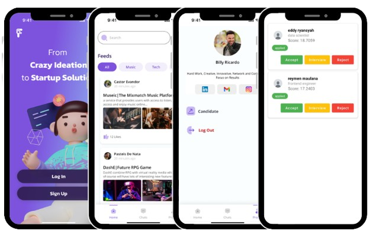

# indUp

  

 

<table>
<tr>
<td>

FindUp is an innovative app dedicated to strengthening Indonesia’s thriving startup ecosystem by connecting tech talents with visionary founders. By fostering meaningful collaboration, the platform drives innovation, enhances team synergy, and empowers startups to develop impactful solutions to real-world challenges. Beyond talent matching, FindUp supports the sustainable growth of startups by providing tools and features that help build resilient teams and scale operations effectively. As a catalyst for Indonesia’s digital economy, FindUp is shaping the future of technology and entrepreneurship in the region.

</td>
</tr>
</table>

## Download App
[Link Download]

---

## Features
- Sign Up & Sign In
- Upload Ideas via Post
- Recommendation Feed
- Join Startup Posts
- User Recommendation by CV
  
## Team Members
### Team C242-PS422
| ID              | Name                           | Learning Path       |
|:----------------|:-------------------------------|:--------------------|
| M314B4KY2794    | [Muhammad Erlangga Prasetya](https://github.com/erlanggsss)| Machine Learning    |
| M314B4KY4587    | [Zadan Fairuz Mahitala](https://github.com/zadanfai)| Machine Learning    |
| M008B4KX0564    | [Anisa Nur Rahmalina](https://github.com/futurebiomedeng)| Machine Learning    |
| C314B4KY2991    | [Muhammad Rafi Catur Wijayanto](https://github.com/mraficaturw)| Cloud Computing     |
| C314B4KY2659    | [Muhamad Rizqi Fajri](https://github.com/Berigoo)| Cloud Computing     |
| A314B4KY3776    | [Reymen Maulana](https://github.com/reymen26)| Mobile Development     |
| A314B4KY3493    | [Pradana Wahyu Hidayanto](https://github.com/Pradana245)| Mobile Development  |

---

## Tech Stack

### Machine Learning
- **Tech Stack**: TensorFlow & Keras
- **[Model Repository](https://github.com/Timnas-Bangkit/Findup-ML)**: Contains trained models.

### Cloud Computing
- **Tech Stack**: FastAPI, Firebase, and Cloud SQL.
- **[API CC](https://github.com/Timnas-Bangkit/API-CC)** & **[API ML](https://github.com/Timnas-Bangkit/API-ML)**: Discover how we efficiently handle and secure cloud-based data storage.
  
### Mobile Development
- **Tech Stack**: Android SDK, Kotlin, Retrofit.
- **[App Repository](https://github.com/Timnas-Bangkit/Findup-MD)**: Source code for the Android app.

---
